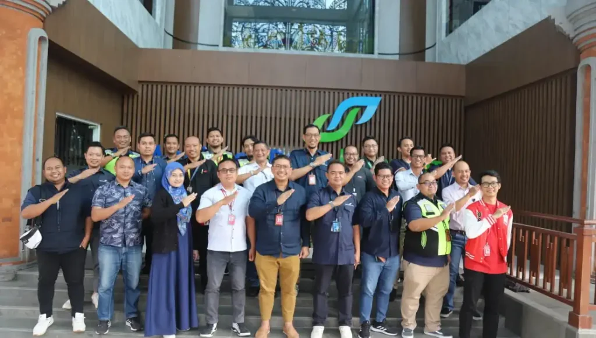

Inalix takes immense pride in introducing the pioneering Inalix ACDM, a homegrown Airport Collaboration Decision Making application in Indonesia. This marks a significant leap forward for the nation’s aviation industry. Notably, Inalix ACDM will be implemented at two prominent locations, namely Angkasa Pura 1 in Surabaya and Denpasar. This achievement solidifies Inalix’s commitment to revolutionizing airport operations through cutting-edge technology.

The highly anticipated launch of Inalix ACDM and its inaugural application from August 23 to 26, 2023, is a monumental event in the realm of aviation technology. During this period, the aviation community will witness firsthand the transformative capabilities of this application. As the first of its kind in Indonesia, Inalix ACDM is poised to streamline operations, optimize collaboration, and enhance decision-making processes in airports. This landmark moment not only signifies a breakthrough for Inalix but also heralds a new era of efficiency and innovation for the entire aviation sector in Indonesia.
