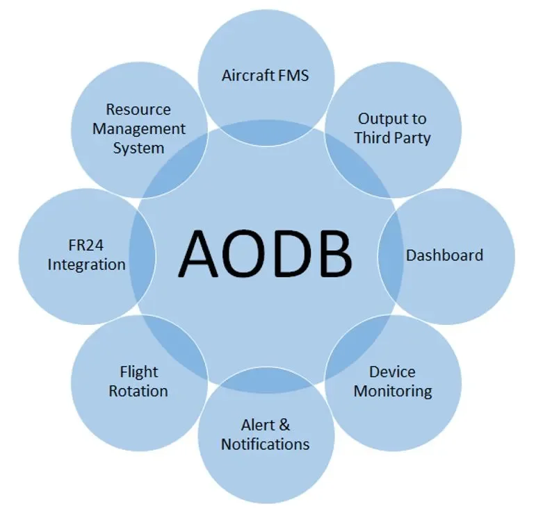

INALIX Airport Operation Data Base (X-AODB) System is a centralized data center that links minimum two or more IT systems which can be managed into an integrated airport operational information database.

X-AODB functions as the nerve center of airport operation, that connects and centralized communication protocols of every IT systems needed, thus keeping the data’s validity and integrity. Centralized data base can help users in making informed decisions.

X-AODB main features are as follows:

- Centralized data and operation, increasing accuracy and efficiency
- Data information center (especially flight data) X-AODB maintains airport data integrity through the use of validity checks and prioritization of data sources to ensure the highest quality of master data
- Advantageous X-AODB modules such as Flight Information Management System, Resource Management System, Equipment monitoring, Airport Turnround View, Airport Map and Airport Portal
- AIDX Standardization
- History of flight data is saved, can be used for airport performance assessment and even to make assumption of projection for years to come
- Integration with other system via standard communication protocols, integrate your X-AODB with FIDS, AAS, MCS, AFTN, SITA, and other systems that are needed to make your system even more reliable
- Real-time or up-to-the minute communication between all of the connected systems
- Expandable to multi-airport system
- ACDM ready
- Selectable Timezone, with default timezone in UTC
- Integration to Master Clock Server Time
- User & Group, set your own groups and users privilege level
- Historical user log, to check your flight data history as well as the user activity
- AODB reports to facilitate your reporting needs based on the operational data
- Flight Pax module
- Flight Management System
- Airport Turnarround View Module
- Arrival Departure View Module
- Daily Rotation Module
- Type-B message parser module
- Overflying Flight module
- Resource Management System Module for Planning as well as Operational
- Airport Map Display Module
- First bag Last Bag Module
- 3rd Party Integration available
- Web-based UI
