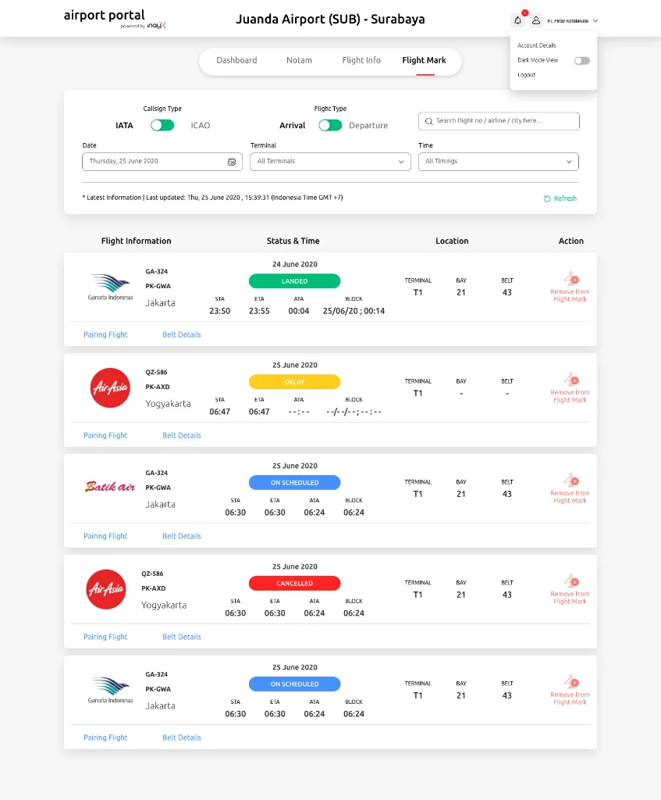

Airport partners and stakeholders are always in need for updated flight information, the usual way to communicate those real time information update is usually done by using traditional ways such as using phones, walkie-talkie or even partners will come to the related office unit just to ask about the flight information update. These obsolete ways takes time, and time is a very much valuable asset in airport operation.

INALIX Airport Portal serves as The One Gate to information, the portal used for the airport officers, users, partners and stakeholders. This one gate information access provides all the needs for flight information update happening in the airport. Airport Portal has the Scheduled Flights, Flights update, Arrival-Departure Information, Aircraft status, Resource usage and NOTAM Information.

Easy to use, web-based Graphical User Interface, real-time view allows more effective information sharing to all the airport users and stakeholders.

### AIRPORT PORTAL FEATURES:

- FLIGHT INFORMATION PORTALWith user access based on their respective privileges, user can view the up-to-date flight information in real time without the needs to manually asking repeatedly about the update to the other units in the airport
- DASHBOARDOverview the real time flight information summary or even the historical data in graphical terms, widgets can be customized as needed.
- WEB-BASEDAccessible from common web browser available on the usual PC OS everywhere.
