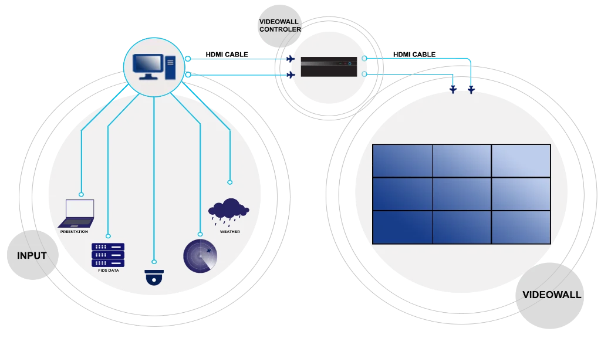
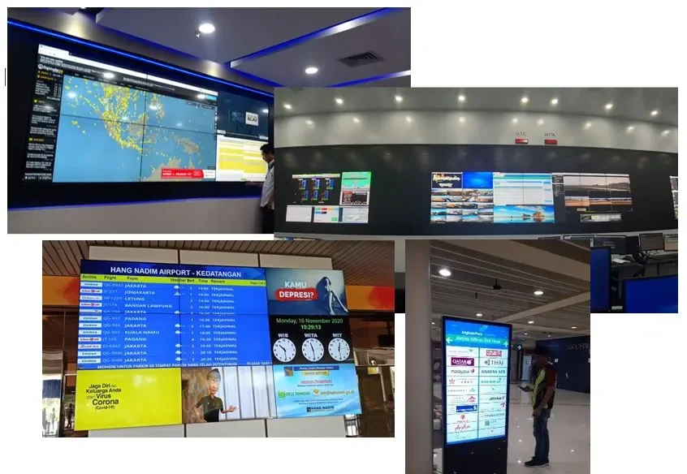

INALIX Digital Signage & Videowall System (X-DSVS) is a visual technology that processes, controls and displays multimedia files in a visual environment that can be configured as needed. Commonly  used for information, entertainment as well as advertising.

X-DSVS can use pictures, videos, documents, or other multimedia information needed that can be displayed into multi-screen frameworks and use high resolution monitors to deliver the best possible information for the intended viewers. Audio option is also available.

