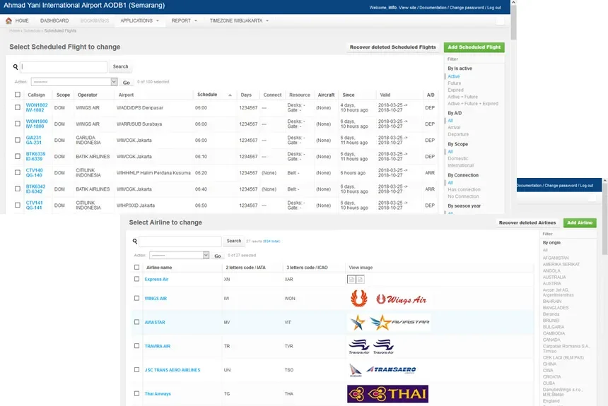
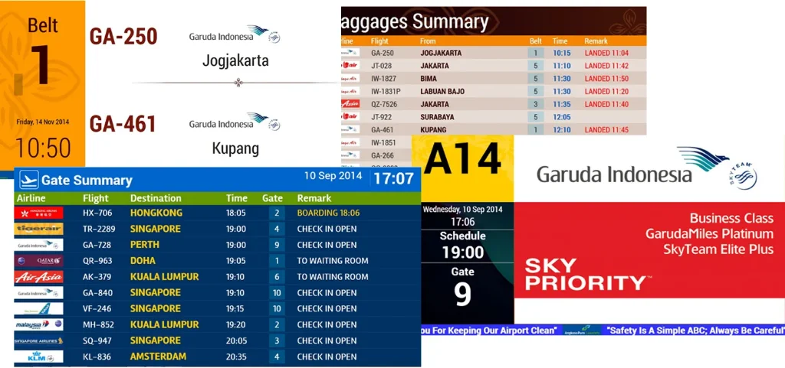

INALIX Flight Information Display System (X-FIDS) is the go to system for displaying up-to-date flight information status that is intended for passengers, general public, airport tenants, airport management and airport operational staff throughout the Airport. Flight information such as Airline, Destination, Origin, Schedule, flight status and other information needed can be displayed by X-FIDS through X-FIDS client display that are installed in the airport’s crucial points and commemorate all of the airport’s need for flight information update.

X-FIDS is the terminal system that provides real time information to airport users. This information includes flights, assigned check-in desks, boarding gates, departure and arrival times, baggage claim allocation. This public information system, which is the essential communication tool between the airport and passengers, is deployed all over the airport and requires high configuration capabilities and maximum availability. FIDS is a modular system, allowing the airport to acquire strictly the required modules facilitating the systems architecture simplification and reducing investment.

### FIDS Features

X-FIDS main features are as follows:

- Real time public display for scheduled flight
- Flight Status update (Check-in Open, Check-in Close, Boarding, Landing, Gate Open, Delay, Cancel, etc)
- Daily flight form
- Multi-user operation
- Web-based GUI
- Multi Display supported (LCD, LED, Videowall, and other airport display)
- Custom template for each unique airport theme and Airline Special Desk
- Redundant server configuration available
- 3rd party integration available (Master Clock System’s NTP, Automatic Announcement System, AFTN & other interfaces needed)
- Support SoC Display: LG WebOS, while Android & Tizen OS under development
- Green airport, as in using the most efficient energy in all our platform
- Real Time Flight Operational Data Update
- Dynamic FIDS Template
- Real Time Flight Operational Data Update
- FIDS Display License available in units or bulks
- Historical user log, to check your flight data history as well as the user activity
- User-friendly FIDS Template Editor
- FIDS Page Slider with scheduling available
- Emergency button that can be integrated with AODB
- Dynamic FIDS Template
- Full redundancy and load balancing with 2N+1 Server configuration
- FIDS Display Monitoring Module
- Real Time Flight Operational Data Update
- Embedded OS Monitor supported
- 3rd Party Integration available

## X-FIDS GUI for Operator

## X-FIDS Template Examples

### Power your LG Digital Signagewith webOS Signage

webOS Signage is a developer-friendly platform that provides powerful features to leverage in creating rich web apps for LG Digital Signage using HTML5, JavaScript, CSS3, and more.

Our webOS based FIDS Signage provides reliable and robust application and yet provides lower Cost of Ownership.  Utilizing the embedded CPU thus eliminating conventional graphic generator / display controller.
