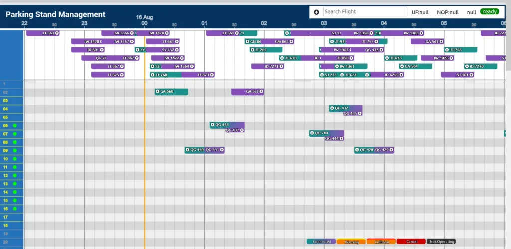
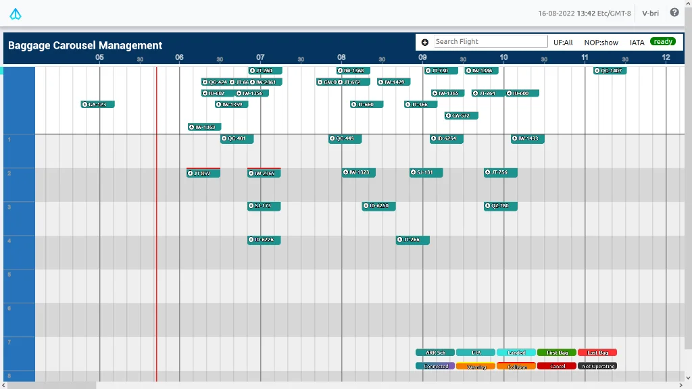
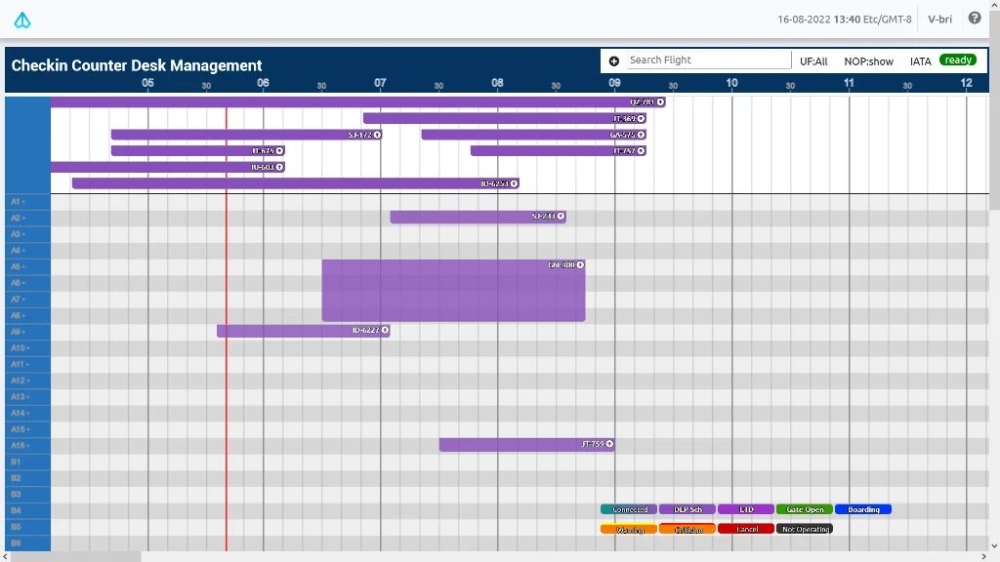

Real-time flight management is a critical point to have in all of Airport operation business. All kind of resources must be used accordingly in order to met the maximum revenue and profit. With a very high-intensity day-to-day operational working environment, usually the resource operator is taking an overhead when the said airport does not have an integrated resource management system.

INALIX Resource Management System is a real-time parking stand resource management system that uses a graphical user interface to see all the resources and all the flight schedule that an airport have to operate. The resource such as bay is available to be managed via a Gantt Chart model of planning as well as the operational flight. Covering main airport resources such as Parking Stand or Bay, Check-In Desk, Gate, and Belt. Our system can be integrated with FIDS or AODB to ensure the flight schedule data is updated.

Easy to use, web-based Graphical User Interface, real-time view allows more effective use of resource, makes our Resource Management System as one of the best system there is.

### X-RMS FEATURES:

- EASY TO USE With Graphical User Interface, the user only has to Click and Drag to manage the resource plotting to fit the schedule of flight.  See all the resource and time frame, so you can manage more efficiently.
- PLAN & OPERATIONAL Every resource for every flight, all of that can be managed real-time or you can do some planning ahead of the flight schedule to maximize your resource usage.
- WEB-BASED Accessible from common web browser available on the usual PC OS everywhere.
