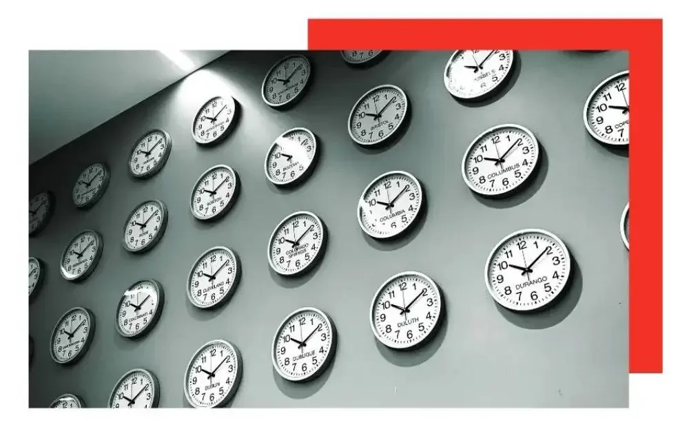

Pernahkah Anda bertanya-tanya bagaimana bandara melacak waktu dan memastikan bahwa penerbangan berangkat dan tiba sesuai jadwal? Jawabannya terletak pada jam utama (master clock) bandara, sebuah sistem penunjuk waktu berpresisi tinggi yang memainkan peran penting dalam perjalanan udara.

## **Apa itu jam utama bandara?**

Jam utama bandara adalah sistem penunjuk waktu presisi yang menyinkronkan semua jam di seluruh area bandara, termasuk di terminal, menara kendali, dan di lapangan terbang. Jam ini biasanya terhubung ke sistem GPS untuk memastikan akurasinya.

## **Bagaimana cara kerja jam utama bandara?**

Jam utama bandara bekerja dengan menerima sinyal dari sistem GPS yang memberikan waktu dan koordinat pasti dari bandara. Sinyal ini kemudian digunakan untuk menyinkronkan semua jam yang ada di bandara.

## **Pentingnya ketepatan waktu dalam perjalanan udara.**

Ketepatan waktu sangat penting dalam perjalanan udara untuk beberapa alasan. Pertama, memastikan pesawat lepas landas dan mendarat sesuai jadwal. Kedua, membantu pengatur lalu lintas udara mengoordinasikan pergerakan pesawat. Terakhir, ini penting untuk keselamatan penumpang karena memastikan perawatan pesawat dilakukan tepat waktu.

## **Manfaat menggunakan jam utama bandara.**

Penggunaan jam utama memberikan manfaat besar, mengurangi penundaan, meningkatkan efisiensi, dan meminimalkan risiko tabrakan atau bahaya keselamatan lainnya.

## **Kemajuan masa depan dalam teknologi jam utama bandara.**

Seiring berkembangnya teknologi, jam utama bandara juga akan terus maju. Salah satu perkembangannya adalah integrasi jam utama bandara dengan sistem lain, seperti pemantauan cuaca dan pelacakan penerbangan.
