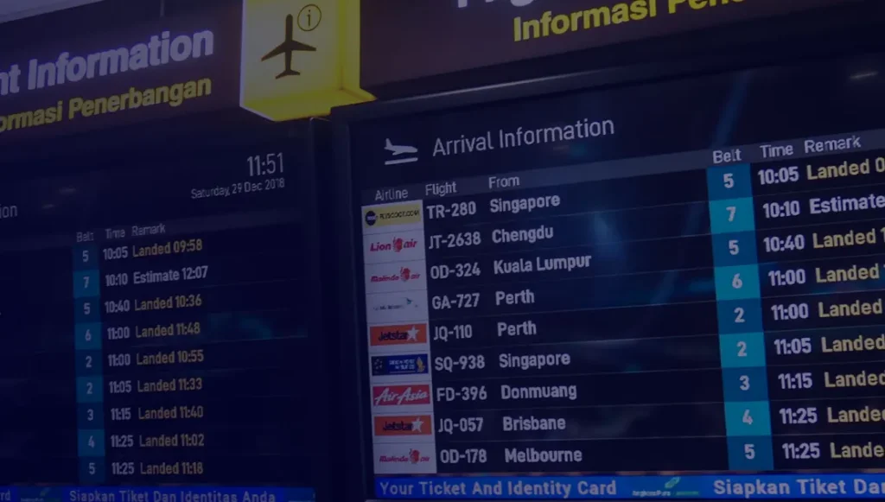

Perangkat lunak Inalix Airport FIDS adalah alat yang ampuh yang dapat membantu bandara mengelola operasionalnya dengan lebih efisien dan memberikan pengalaman yang lebih baik bagi penumpang.

## **Apa itu perangkat lunak FIDS dan bagaimana cara kerjanya?**

FIDS adalah singkatan dari Flight Information Display System, sebuah perangkat lunak yang digunakan bandara untuk menampilkan informasi penerbangan real-time kepada penumpang. FIDS mengumpulkan data dari berbagai sumber seperti maskapai, ground handler, dan kontrol lalu lintas udara, lalu menampilkannya di layar.

## **Manfaat perangkat lunak FIDS Inalix untuk operasional bandara.**

Perangkat lunak FIDS menawarkan banyak manfaat bagi operasional bandara, termasuk peningkatan efisiensi dan penghematan biaya. Dengan mengotomatiskan proses pengumpulan dan penampilan data, beban kerja staf berkurang dan risiko kesalahan diminimalkan.

## **Meningkatkan pengalaman penumpang dengan FIDS Inalix.**

Perangkat lunak FIDS sangat meningkatkan pengalaman penumpang dengan menyajikan pembaruan secara real-time. Hal ini mengurangi waktu tunggu dan kebingungan penumpang di bandara.

## **Informasi penerbangan real-time.**

Salah satu manfaat utamanya adalah kemampuan untuk memberikan informasi penerbangan dan pembaruan secara real-time kepada penumpang, termasuk penundaan, pembatalan, perubahan gerbang, dan waktu boarding.

## **Opsi penyesuaian untuk bandara dan maskapai.**

Perangkat lunak Inalix Airport FIDS menawarkan berbagai opsi penyesuaian. Bandara dapat menyesuaikan tampilan informasi, ukuran font, warna, serta menambahkan pencitraan merek (branding) dan iklan.
