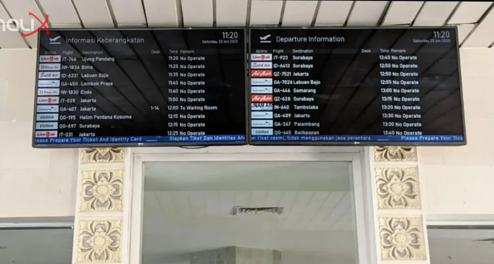

Solusi Bandara Inalix meliputi FIDS dan Sistem Digital Signage. Pada postingan kali ini kami akan menunjukkan solusi kami yang diterapkan di Bandara Internasional Ngurah Rai, Bali.

Dalam penerapannya pada layar untuk pengunjung bandara, FIDS dan Digital Signage dapat digabungkan. Sehingga terdapat fleksibilitas untuk memadukan informasi penerbangan, rambu, informasi fasilitas bandara, dan papan reklame digital bandara.

Berikut ini adalah beberapa contoh implementasi kami di Bandara Internasional Ngurah Rai.

### Informasi Penerbangan Dasar

### Pesan Informasi Publik + Informasi Penerbangan

")

### Informasi Bandara + Informasi Penerbangan

Informasi Penerbangan + Informasi Bandara (Bandara Internasional Ngurah Rai)

### Digital Signage + Pesan Informasi Publik

Digital Signage + Pesan Informasi Publik

-------------------------------------

Digital Signage + Informasi Penerbangan

Informasi Jam Dunia (World Clocks)

-------------------------

Pesan Penyambutan & Perpisahan (Welcoming & Farewell Message)

------------------------------------

Inalix juga menyediakan solusi lain untuk Bandara Ngurah Rai:

* Sistem Pengumuman Otomatis
* Database Operasional Bandara
* Sistem Penagihan Bandara
* Jam Utama (Master Clock)
* Pusat Komando (Command Center)

Mungkin di postingan berikutnya kami akan menulisnya di artikel kami yang lain.
