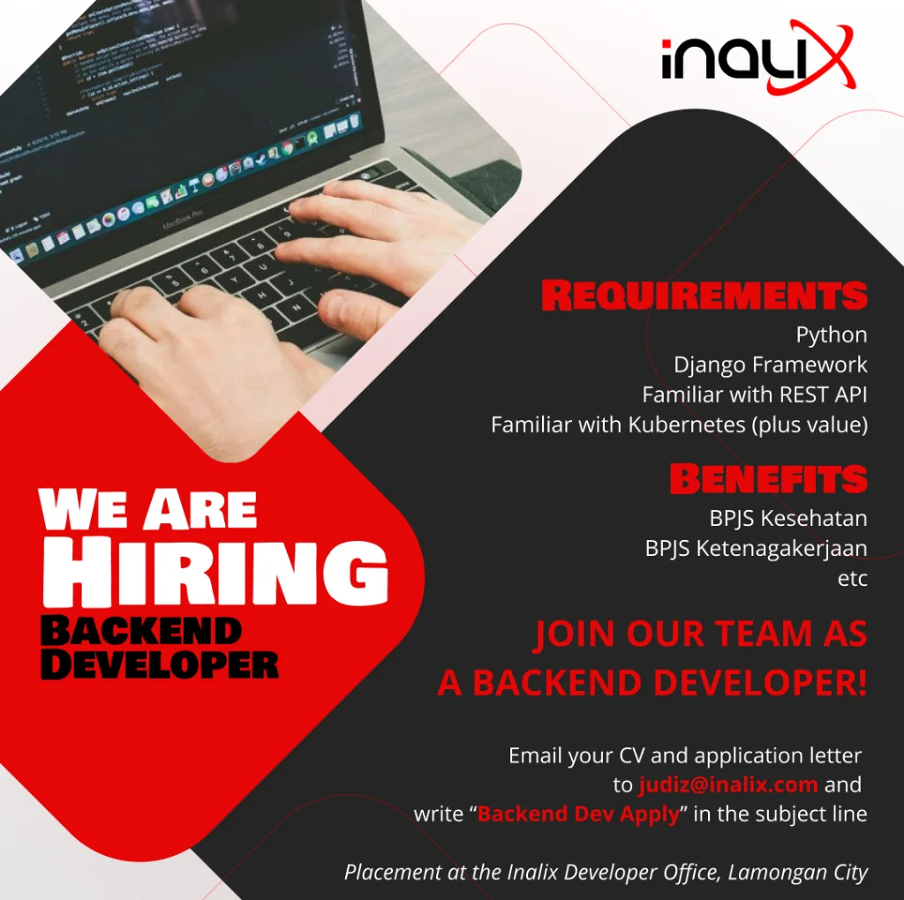

**Bergabunglah Bersama Tim Kami Sebagai Back-End Developer di Inalix**

Apakah Anda siap untuk memulai perjalanan di mana keahlian coding Anda dapat mendefinisikan ulang masa depan solusi bandara? Di Inalix, kami memiliki misi untuk mentransformasi industri bandara dengan perangkat lunak inovatif yang meningkatkan keselamatan, efisiensi, dan pengalaman penumpang. Sebagai Back-End Developer di Inalix, Anda akan berada di garis depan transformasi ini, bekerja pada proyek-proyek mutakhir yang mendorong evolusi digital bandara.

Persyaratan:

- Python
- Django Framework
- Terbiasa dengan REST API
- Terbiasa dengan Kubernetes (nilai tambah)

Manfaat:

- BPJS Kesehatan
- BPJS Ketenagakerjaan

Kirimkan CV dan surat lamaran Anda ke [judiz@inalix.com](mailto:judiz@inalix.com) dan tulis "Backend Dev Apply" pada baris subjek.

Penempatan di Kantor Pengembang Inalix, Lamongan – Jawa Timur
