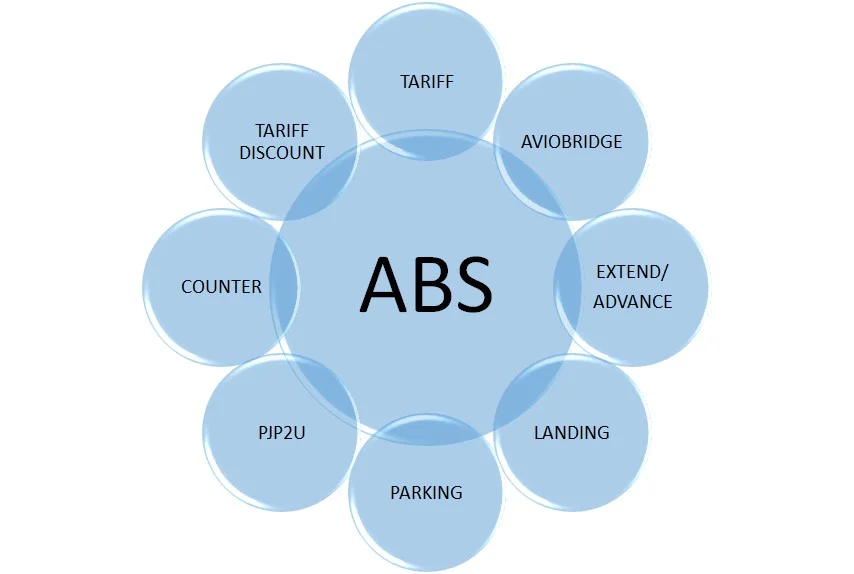

Inalix Aero Billing System (X-ABS) memenuhi kebutuhan Anda akan sistem perhitungan dan penagihan penerbangan. X-ABS mampu menghasilkan faktur dan laporan keuangan lainnya yang dihitung secara otomatis sesuai dengan database operasional penerbangan yang disimpan dalam sistem X-AODB.

## Fitur utama X-ABS adalah sebagai berikut:

Perhitungan otomatis tagihan penerbangan dari data operasional. Berbasis web Multi-pengguna dan grup dengan tingkat otentikasi yang berbeda-beda. Memenuhi kebutuhan penagihan penerbangan Anda. Tersedia templat bawaan, kustomisasi sangat mungkin dilakukan. Tarif, jenis tarif, diskon, dan nilai tukar mata uang yang dapat disesuaikan. Menghasilkan faktur & laporan, dari laporan harian yang tidak terjadwal hingga bulanan yang terjadwal. Terintegrasi dengan X-AODB atau sistem database informasi penerbangan lainnya.
