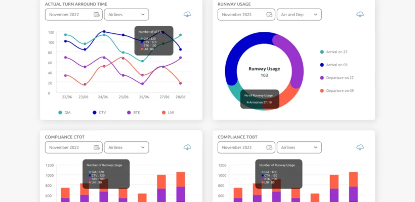

Mitra bandara dan pemangku kepentingan selalu membutuhkan informasi penerbangan terkini, cara biasa untuk mengkomunikasikan pembaruan informasi real-time tersebut biasanya dilakukan menggunakan cara tradisional seperti telepon, walkie-talkie atau mitra akan datang ke unit kantor terkait hanya untuk menanyakan tentang pembaruan informasi penerbangan. Cara-cara usang ini membutuhkan waktu, dan waktu adalah aset yang sangat berharga dalam operasi bandara.

Portal Bandara INALIX berfungsi sebagai Satu Pintu menuju informasi, portal yang digunakan untuk petugas bandara, pengguna, mitra, dan pemangku kepentingan. Akses informasi satu pintu ini memenuhi semua kebutuhan pembaruan informasi penerbangan yang terjadi di bandara. Portal Bandara memiliki Penerbangan Terjadwal, pembaruan Penerbangan, Informasi Kedatangan-Keberangkatan, status Pesawat, penggunaan Sumber Daya, dan Informasi NOTAM.

Antarmuka Pengguna Grafis berbasis web yang mudah digunakan, tampilan real-time memungkinkan berbagi informasi yang lebih efektif ke semua pengguna dan pemangku kepentingan bandara.

### FITUR PORTAL BANDARA:

- PORTAL INFORMASI PENERBANGAN Dengan akses pengguna berdasarkan hak istimewa mereka masing-masing, pengguna dapat melihat informasi penerbangan terkini secara real time tanpa perlu secara manual menanyakan berulang kali tentang pembaruan tersebut ke unit-unit lain di bandara.
- DASHBOARD Tinjauan ringkasan informasi penerbangan real-time atau bahkan data historis dalam bentuk grafis, widget dapat disesuaikan sesuai kebutuhan.
- BERBASIS WEB Dapat diakses dari browser web umum yang tersedia pada OS PC biasa di mana saja.
