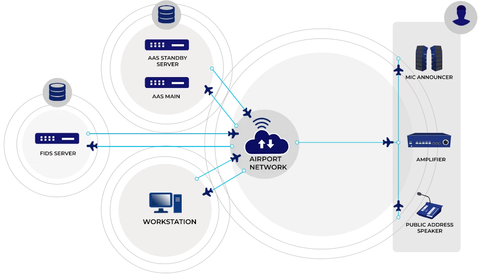
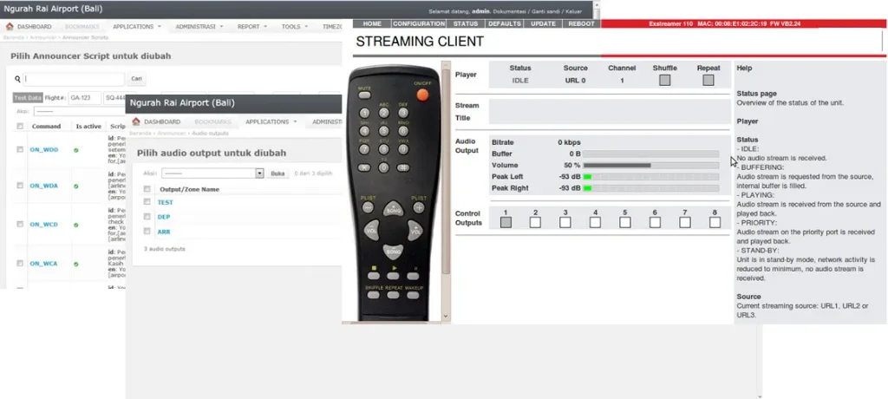

Sistem Pengumuman Otomatis INALIX (X-AAS) memberikan otomatisasi real-time dari pengumuman suara untuk penumpang di seluruh terminal. Sistem ini dikonfigurasi sehingga tidak diperlukan campur tangan manusia, sistem secara otomatis menyiarkan melalui pengeras suara publik (public address) yang ada ketika ada pembaruan status penerbangan dari FIDS. X-AAS adalah salah satu sistem penting untuk mendukung operasional bandara, pengumuman otomatis menghilangkan kebutuhan akan pengumuman suara manual yang lama oleh operator ketika ada pembaruan baru pada status penerbangan atau pengumuman informasi harian rutin untuk pengguna bandara.

### Fitur **X-AAS**

Fitur utama X-AAS adalah sebagai berikut:

- Output suara yang nyata/alami/seperti manusia
- Pengumuman multibahasa, mulai dari bahasa default Indonesia dan Inggris hingga modul ekstensi bahasa yang dibutuhkan termasuk Mandarin, Jepang, Arab atau bahkan bahasa daerah Indonesia
- Pengumuman bahasa selektif untuk tujuan spesifik
- Pengumuman yang dikontrol berdasarkan zona, meminimalkan kebisingan di dalam terminal dengan memilih zona tertentu untuk menyiarkan
- Desain modular, zona pengumuman yang dapat diperluas
- Integrasi dengan sistem lain, seperti sistem darurat bandara
- Skrip Penyiar, buat skrip Anda sendiri menggunakan database suara yang luas.

