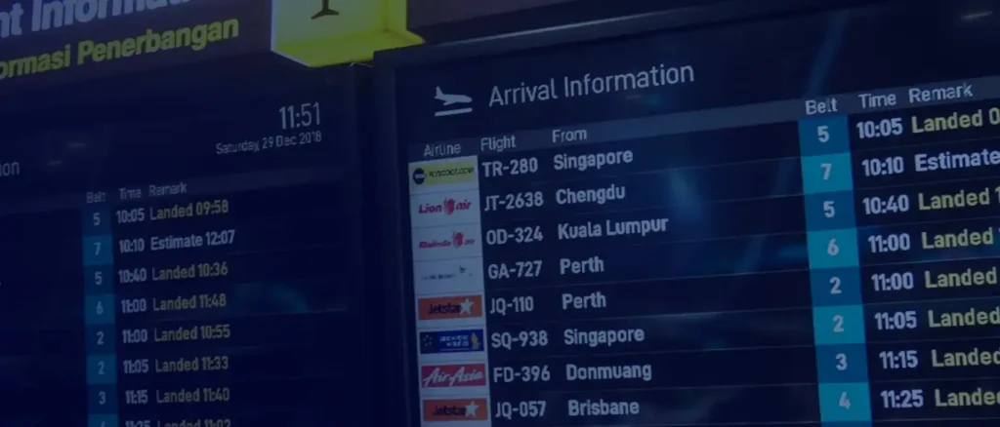

Sistem Tampilan Informasi Penerbangan INALIX (X-FIDS) adalah sistem pilihan untuk menampilkan status informasi penerbangan terkini yang ditujukan bagi penumpang, masyarakat umum, penyewa bandara, manajemen bandara, dan staf operasional bandara di seluruh area Bandara. Informasi penerbangan seperti Maskapai, Tujuan, Asal, Jadwal, status penerbangan, dan informasi lainnya yang dibutuhkan dapat ditampilkan oleh X-FIDS melalui tampilan klien X-FIDS yang dipasang di titik-titik penting bandara untuk memenuhi semua kebutuhan bandara akan pembaruan informasi penerbangan.

X-FIDS adalah sistem terminal yang menyediakan informasi real-time bagi pengguna bandara. Sistem publik ini adalah alat komunikasi penting yang tersebar di seluruh bandara dan membutuhkan kemampuan konfigurasi tinggi serta ketersediaan maksimum.

### Fitur FIDS

- Tampilan publik real-time untuk penerbangan terjadwal
- Pembaruan Status Penerbangan (Check-in Open, Check-in Close, Boarding, Landing, Gate Open, Delay, Cancel, dll)
- Form penerbangan harian
- Operasi multi-pengguna
- GUI berbasis web
- Mendukung Multi Display (LCD, LED, Videowall)
- Templat kustom untuk setiap tema bandara dan Meja Khusus Maskapai
- Konfigurasi server redundan tersedia
- Integrasi pihak ketiga tersedia
- Pembaruan Data Operasional Penerbangan Secara Real-Time
- Template FIDS yang dinamis dan editor yang mudah digunakan

## GUI X-FIDS untuk Operator

## Contoh Template X-FIDS

### Digital Signage yang ditenagai oleh webOS Signage

Sistem FIDS Signage berbasis webOS kami menyediakan aplikasi yang andal dan kuat namun tetap memberikan Total Cost of Ownership (Biaya Kepemilikan) yang lebih rendah.
