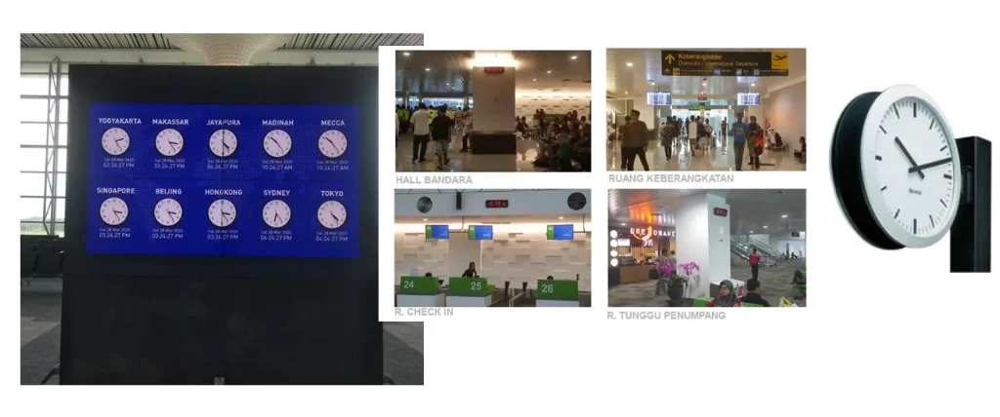

Sistem Jam Utama Inalix (X-MCS) adalah protokol waktu terpusat yang menyediakan waktu tersinkronisasi dan akurat hingga hitungan detik ke jaringan dengan ukuran berapa pun. X-MCS menggunakan sistem yang memanfaatkan waktu satelit GPS dari seluruh dunia (bergantung pada lokasi) untuk mendapatkan waktu dasar UTC yang akurat dan kemudian didistribusikan ke semua peralatan elektronik yang membutuhkan waktu tersinkronisasi di bandara.

X-MCS menggunakan server waktu (time server) dengan osilator presisi dan sangat stabil yang mampu menjembatani gangguan atau hilangnya sinyal sementara. Dengan klien waktu tambahan (slave clocks) berbasis IP dan Power-Over-Ethernet (PoE), Anda tidak perlu lagi menyesuaikan waktu atau mengganti baterai.

### Fitur utama X-MCS adalah sebagai berikut:

- Menyediakan sumber waktu referensi berkualitas tinggi
- Server dan klien waktu yang kompatibel dengan NTP atau SNTP
- Tersedia redundansi
- Cakupan penggunaan yang luas untuk perlengkapan operasional seperti AODB, FIDS, AAS, ABS, CCTV, sistem lain yang menggunakan NTP
