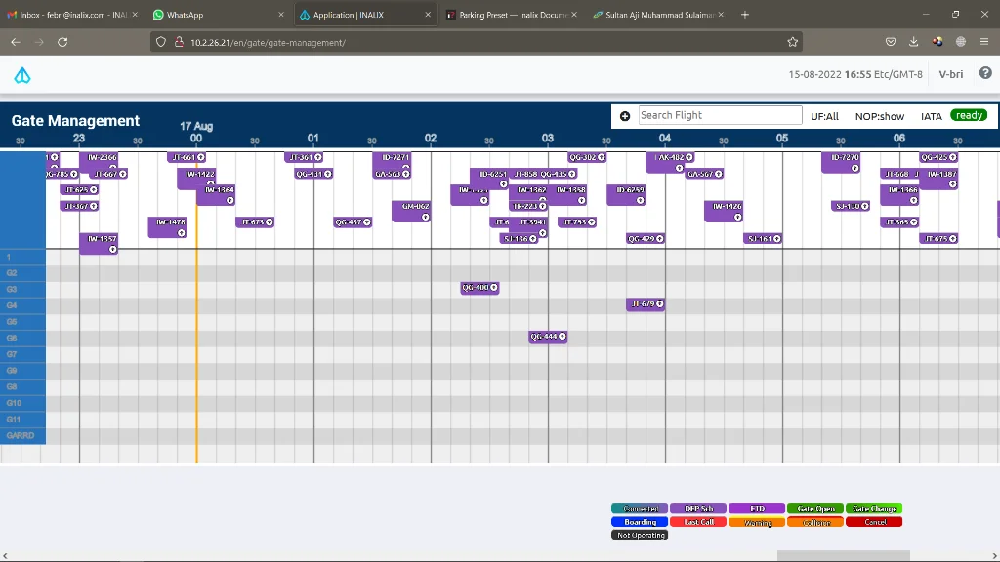

Manajemen penerbangan real-time adalah poin penting yang harus dimiliki dalam seluruh bisnis operasional Bandara. Semua jenis sumber daya harus digunakan secara tepat untuk mencapai pendapatan dan laba maksimum. Dengan lingkungan kerja operasional sehari-hari yang intensitasnya sangat tinggi, operator sumber daya sering kali mengalami beban berlebih ketika bandara tersebut tidak memiliki sistem manajemen sumber daya yang terintegrasi.

Sistem Manajemen Sumber Daya INALIX adalah sistem manajemen sumber daya parking stand real-time yang menggunakan Graphical User Interface (Antarmuka Pengguna Grafis) untuk melihat semua sumber daya dan semua jadwal penerbangan yang harus dioperasikan bandara. Sumber daya seperti area parkir (bay) tersedia untuk dikelola melalui model perencanaan Gantt Chart maupun operasional penerbangan nyata.

Antarmuka yang mudah digunakan berbasis web, serta tampilan real-time memungkinkan penggunaan sumber daya yang lebih efektif.

### FITUR X-RMS:

- MUDAH DIGUNAKAN Dengan Antarmuka Pengguna Grafis, pengguna hanya perlu Klik dan Geser (Drag and Drop) untuk mengelola plotting sumber daya agar sesuai dengan jadwal penerbangan. Lihat semua sumber daya dan kerangka waktu, sehingga Anda dapat mengelola dengan lebih efisien.
- RENCANA & OPERASIONAL Setiap sumber daya untuk setiap penerbangan, semua itu dapat dikelola secara real-time atau Anda dapat melakukan beberapa perencanaan mendahului jadwal penerbangan untuk memaksimalkan penggunaan sumber daya Anda.
- BERBASIS WEB Dapat diakses dari browser web umum yang tersedia pada OS PC biasa di mana saja.
