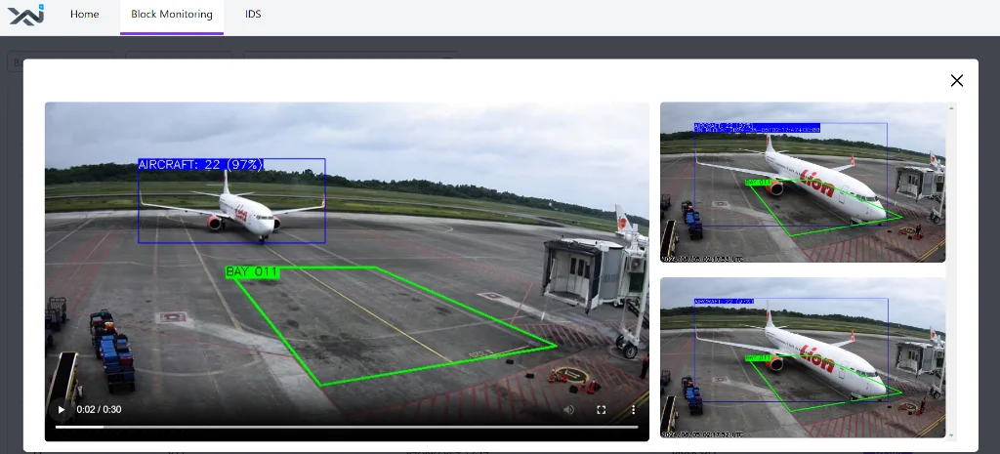

X-AiVision adalah solusi canggih yang menggunakan kecerdasan buatan (AI) untuk menganalisis, memahami, dan menginterpretasikan gambar dan video digital. Aplikasi ini memungkinkan bisnis untuk meningkatkan efisiensi, akurasi, dan inovasi di berbagai industri. Industri penerbangan telah mengadopsi teknologi computer vision (visi komputer) untuk meningkatkan keselamatan dan efisiensi perjalanan udara. Bidang penggunaannya sangat luas dan mencakup pengenalan dan deteksi pesawat terbang, keamanan bandara, manajemen, dll.

Keselamatan dan keamanan dideteksi dengan mengidentifikasi kondisi anomali, pola atau kesalahan yang tidak biasa pada gambar atau video. Penyusup yang memasuki area terlarang akan selalu dipantau. Peringatan, alarm, atau pemberitahuan lainnya, dapat diintegrasikan ke dalam teknologi ini.

Inalix AiVision adalah computer vision yang dirancang untuk kebutuhan bandara, siap untuk mencakup kebutuhan sisi udara (airside) dan darat (landside), serta semua area kedatangan, konter check-in, ruang tunggu, gerbang (gate), apron, ban berjalan (conveyor belt), dan lainnya.

### FITUR

Fitur utama X-AiVision adalah sebagai berikut:

- Perekaman Data Real-Time: Sistem merekam semua aktivitas secara real-time, memastikan bahwa data terkait operasional bandara selalu mutakhir dan siap untuk segera digunakan dan dianalisis.
- Deteksi Anomali Otomatis: Memanfaatkan algoritma AI, X-AiVision dapat mendeteksi pola yang tidak biasa, potensi pelanggaran keamanan, atau masalah operasional.
- Integrasi dengan Sistem yang Ada: X-AiVision dirancang untuk terintegrasi secara mulus dengan sistem bandara yang ada seperti AODB, FIDS, dan AAS.
- Peningkatan Analisis Data: Sistem menyediakan alat untuk menganalisis data yang dikumpulkan, memungkinkan pengambilan keputusan yang lebih baik.
- Kemampuan Prediktif: Dengan menganalisis tren dan data dari waktu ke waktu, X-AiVision membantu memprediksi kebutuhan operasional masa depan.
- Antarmuka Ramah Pengguna (User-Friendly): Menampilkan antarmuka pengguna yang lugas dan intuitif.
- Peringatan dan Pemberitahuan yang Dapat Disesuaikan.
